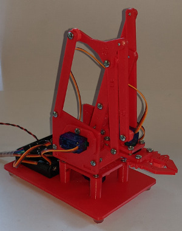
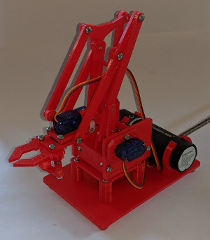

# MeArm v0.4 robot arm
 Documentation and Python code for Raspberry Pi single board computers (SBCs).

 &nbsp; &nbsp; &nbsp; &nbsp;

A robot arm project, as shown above, that uses the Raspberry Pi Maker Kit with [more detailed project information provided here](https://onlinedevices.co.uk/RPi+Maker+Kit+-+MeArm+robot+arm+project).

The designs for all the associated custom 3D printed components will be made available for downloaded from the Prusa web site soon.

The available code shows how the robot arm can be moved through designated x, y, z coordinates and documentation is to be provided that shows how the robot arm is built and the code used. 

