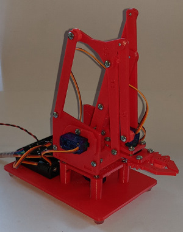
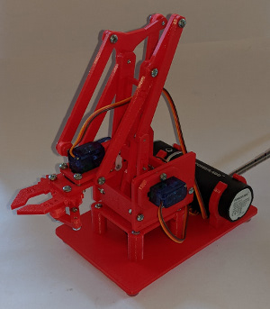

# MeArm v0.4 robot arm
 Documentation and Python code for Raspberry Pi single board computers (SBCs). The code and documentation has been updated to allow for a generalised username instead of the 'older' default username 'pi'.

 &nbsp; &nbsp; &nbsp; &nbsp;

A robot arm project, as shown above, that can use the Raspberry Pi Maker Kit to simplify interconnect but can also just as easily be connected to a Raspberry Pi in a conventional/direct way. More detailed project information is provided [here](https://onlinedevices.org.uk/Raspberry%2BPi%2BMaker%2B-%2BMeArm%2Brobot%2Barm%2Bproject).

The designs for all the associated custom 3D printed components are also available for download from the Prusa web site [here](https://www.printables.com/model/113779-robot-arm-controlled-by-a-raspberry-pi).

The available code shows how the robot arm can be moved through designated x, y, z coordinates and documentation is provided that shows how the robot arm is built and the code used. 

